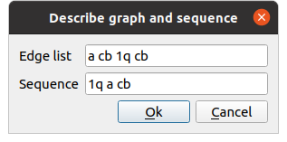
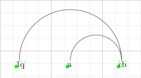

# Embedding Visualizer for IPE

[IPE](http://ipe.otfried.org/) is an extensible drawing editor software specially targeted at making figures for inclusion into LaTeX documents, as well as multi-page PDF presentations.

This repository contains a small extension of IPE, a so-called _ipelet_. The ipelet in this repository aims at provinding an automatic tool for drawing linear arrangements of graphs, also called embeddings.

The usage of this ipelet is simple. The user only has to describe the graph as a space-separated list of edges, and the (inverse) linear arrangement, where

- an edge consists of two strings, separated by spaces, each string representing a vertex of the graph; the contents of the string are completely arbitrary. For example: "1 2 2 3"
- The (inverse) linear arrangement is simply the sequence of vertices as placed in the one-dimensional layout. For example, if the arrangement of the vertices is: a(1)=3, a(2)=1, a(3)=2 -- meaning that vertex '1' is at position '3', and so on -- the sequence is: "2 3 1".

A more complicated example is the one given in the figure: the graph's vertices are "a cb 1q", its edges are "a cb 1q cb", and the sequence is "1q a cb".

## History of changes

### 1st October 2020

- Extended the ipelet to admit two diferent representations of a linear arrangement. The actual linear arrangement and the inverse linear arrangement (the so far so-called sequence).

### 30th September 2020

- Extended the ipelet to accept string and character values for the description of the graph and the embedding.
- Change label's text to say "Sequence" instead of "Embedding".

### 29th September 2020

Created repository with first version of the ipelet.
