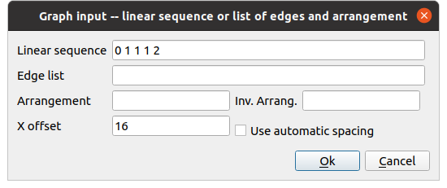
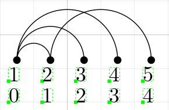
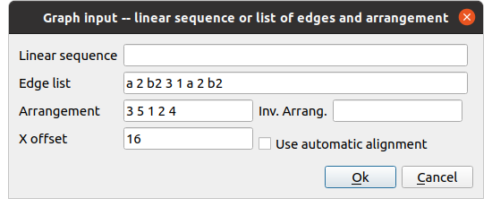
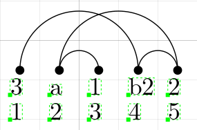
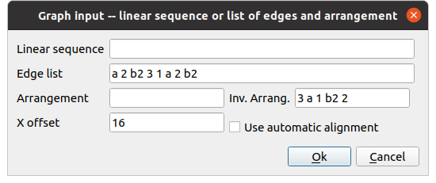
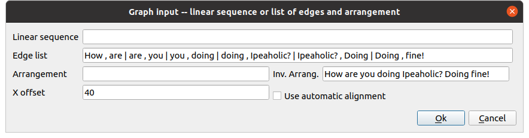
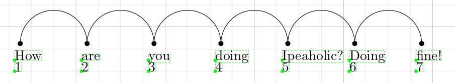
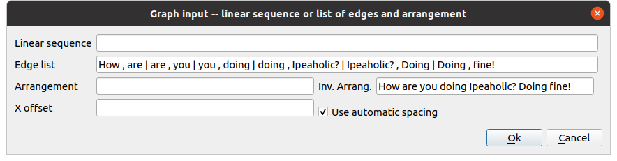
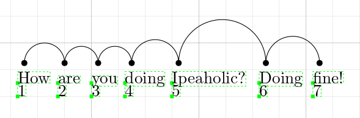

# Embedding Visualizer for IPE

[IPE](http://ipe.otfried.org/) is an extensible drawing editor software specially targeted at making figures for inclusion into LaTeX documents, as well as multi-page PDF presentations. This repository contains a small extension of IPE, a so-called _ipelet_. The ipelet in this repository aims at provinding an automatic tool for drawing _linear_ arrangements of graphs, also called embeddings.

The usage of this ipelet is simple. The user has to describe the graph as either:

- a linear sequence of vertex-parent values, or as a
- a list of edges plus an (inverse) arrangement.

## Linear sequences

In the first case, no more information is needed. In every position _i_ of the sequence, the value _p_ indicates the parent vertex of _i_, whenever _p_ is not 0. For example, the sequence

	0 1 1 1 2

tells that the vertex at position 1 has no parent, the vertex at position 2 has as parent the vertex at position 1, and so on, until the last value, which indicates that the vertex at position 5 has as parent the vertex at position 2. The user only has to fill in the first text box of the pop up dialog:

to obtain the desired result

This sequence must contain only numeric values.

## List of edges + (inverse) arrangement

In the second case, every edge is an space-separated pair of alphanumeric strings. It goes without saying that each string represents a vertex of the graph. For example, the string "a 2 b2 3 1 a 2 b2" encodes the list of edges \{a,2\}, \{b2,3\}, \{1,a\} and \{2,b2\}, and the vertices of the graph, ordered lexicographically, are \{1,2,3,a,b2\}. This string can be given also as a comma-separated `|`-separated list of strings

	a,2 b2,3 1,a 2,b2
	a, 2 b2, 3 1, a 2, b2
	a ,2 | b2   , 3 || 1, a 2, b2
	a ,2 | b2   , 3 | 1, a | 2, b2

and, more simply

	a,2 | b2,3 | 1,a | 2,b2

In order to draw the (linear) embedding this has to be given by the user either in its less intuitive form, in the form of an _arrangement_, or in a more intuitive form, the _inverse arrangement_ (for the more mathematically inclined, an arrangement is a bijection between the vertex set and a set of consecutive integers -- it can also be seen as a permutation of the vertex set.) As an example of an arrangement using the graph above, we can define the arrangement _pi_ as follows

	pi(1)  = 3
	pi(2)  = 5
	pi(3)  = 1
	pi(a)  = 2
	pi(b2) = 4

ans so the arrangement would be

	3 5 1 2 4

An arrangement can **only** contain **numerical** values, as these indicate the positions of the vertices. Notice that the numbers refer to the positions of the vertices, the **first number** giving the position of the **first vertex in the lexicographic order**. The lexicographic order is defined so that shorter strings are to the left of longer strings. Equally-long strings are sorted as usual. This example would be given in the ipelet as follows:

and the rendered result is:

where the numbers 1 to 5 indicate the position of the arrangement.

The inverse linear arrangement is far more intuitive. It is, simply, the sequence of vertices as placed in the one-dimensional layout. For example, consider the arrangement given above. Its inverse linear arrangement is:

	3 a 1 b2 2

Therefore, this rather intuitive concept makes the usage of the ipelet slightly easier. Using as input

the rendered result is the same as before:

**Notice** that Ipe renders LaTeX text, so the graph's edges can be given with LaTeX-formatted strings. For example, the list of edges given as "\$a\$ \$2\$ \$b_2\$ \$3\$ \$1\$ \$a\$ \$2\$ \$b_2\$" and the _arrangement_ "3 5 1 2 4" together produce

As a final note to this user's guide, now comes an example of using the "Use automatic spacing" feature. When checked, the ipelet will space the labels of the vertices (and the vertices too) so that they do not overlap in such a way that empty space is reduced. For example, the input

produces this

Notice the extra space between short words: "How" and "are", "are" and "you", ... This can be corrected with the "Use automatic spacing" checkbox. When checked, there is no need to specify an offset. The following input

spaces the labels evenly:

## Installing

Copy all the `.lua` files into your ipelet directory. In Ubuntu, this is `~/.ipe/ipelets/`. Visit the home webpage of IPE for more information.

## History of changes

### 21st March 2021

Renamed 'linear sequence' by 'head vector' and added new features:
- indicate vertex labels in a separate input text box. This works even for head vectors.
- modify the arrangement of a head vector by specifying a linear arrangement or an inverse linear arrangement.

### 3rd February 2021

- Split the main file `embedding_visualizer.lua` into several files, each starting with `ev_`.

### 31st January 2021

- Extended the Ipelet to apply an automatic spacing between the labels of the vertices.
- Updated the examples and added new ones.

### 30th December 2020

- Extended Ipelet to admit linear sequences.
- Uploaded new examples (of the new feature) and updated old examples.
- Code is now substantially better documented.

### 6th October 2020

- The objects created (marks, arcs, labels, ...) are selected to ease future manipulations when several arrangements are to be added to the document.

### 5th October 2020

- Display markers as the vertices of the graph.
- Extended the format of input strings.

### 1st October 2020

- Extended the ipelet to admit two diferent representations of a linear arrangement. The actual linear arrangement and the inverse linear arrangement (the so far so-called sequence).
- Fixed bugs (in the first extension).
- Allow users to choose the x offset.
- In case the arrangement was given (not the inverse), add the labels of the positions at the below the vertices.

### 30th September 2020

- Extended the ipelet to accept string and character values for the description of the graph and the embedding.
- Change label's text to say "Sequence" instead of "Embedding".

### 29th September 2020

- Created repository with first version of the ipelet.
