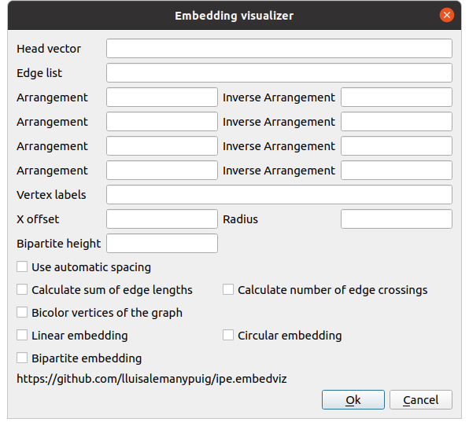
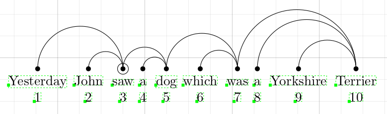
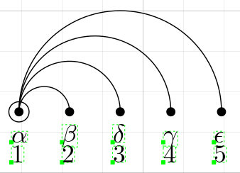

# Embedding Visualizer for IPE

[IPE](http://ipe.otfried.org/) is an extensible drawing editor software specially targeted at making figures for inclusion into LaTeX documents, as well as multi-page PDF presentations. This repository contains a small extension of IPE, a so-called _ipelet_. The ipelet in this repository aims at provinding an automatic tool for drawing _linear_ arrangements of graphs, also called embeddings.

## Main functionalities and purposes

This ipelet is a tool aimed at easing the process of drawing and manually editing linear arrangements of graphs. It can draw a graph from a `head vector` input and also from an `edge list`. Vertices can be mapped to positions indicated by their indices, or indicated by an arrangement function and/or an inverse arrangement function. Users can also label the vertices using math-text, and calculate metrics on the linear arrangement.

Users will find a complete guide at [this ipelet's wiki](https://github.com/lluisalemanypuig/ipe.embedviz/wiki). Here is a screenshot of the main dialog:

and a few examples of what it can do:

## Installing

Copy all the `.lua` files into your ipelet directory. In Ubuntu, this is `~/.ipe/ipelets/`. Visit the home webpage of IPE for more information.

## History of changes

### 24th July 2021

- Merged the two ipelets made on July 23rd, 2021 into a single one. This way it is easier to input the data.

### 23rd July 2021

- Added new ipelete to visualize arrangements in a circular ordering.
- Refactored much of the code so as to avoid repetition.

### 2nd July 2021

- Added option to bicolor the vertices of the graph. The algorithm will successfully bicolor the vertices following the constraints of the graph coloring problem if the graph is bipartite.

### 19th June 2021

- Place position labels in the same vertical line as the vertices.

### 12th June 2021

- Added calculation of the number of edge crossings.

### 29th May 2021

- When using the head vector, add the arcs to the ipe document in a way that the 'forward' arrow points from the head to the dependent. In other words, edges now follow the natural direction of the edge _(u,v)_, i.e., from _u_ to _v_, where _u_ is the head and _v_ is the dependent.
- Improved automatic spacing, and corrected spacing when not using automatic spacing.

### 28th May 2021
- Vertex labels now have to be separated with a '&' (the delimiter) character. Therefore, the string "a & b & c & d" produces the strings "a ", " b ", " c " and " d".

### 17th April 2021

- Implemented a better automatic spacing that takes into account all the dimensions of a text object, namely, its height, width and depth. **Only available on IPE 7.2.24 or newer.**

### 4th April 2021

- Implemented a first approach to a better vertical alignment of the arrangements. Waiting for the next release of IPE to be able to retrieve the height and depth of a text object.

### 28th March 2021

- Added more slots in the dialog for arrangements. Now users can draw up to 4 arrangements for the same graph without having to open the ipelet as many times as arrangements they want to draw.

### 27th March 2021

- Moved usage guide from this README to the brand new wiki for [this ipelet](https://github.com/lluisalemanypuig/ipe.embedviz/wiki).

### 21st March 2021

Renamed 'linear sequence' by 'head vector' and added new features:
- indicate vertex labels in a separate input text box. This works even for head vectors.
- modify the arrangement of a head vector by specifying a linear arrangement or an inverse linear arrangement.

### 3rd February 2021

- Split the main file `embedding_visualizer.lua` into several files, each starting with `ev_`.

### 31st January 2021

- Extended the Ipelet to apply an automatic spacing between the labels of the vertices.
- Updated the examples and added new ones.

### 30th December 2020

- Extended Ipelet to admit linear sequences.
- Uploaded new examples (of the new feature) and updated old examples.
- Code is now substantially better documented.

### 6th October 2020

- The objects created (marks, arcs, labels, ...) are selected to ease future manipulations when several arrangements are to be added to the document.

### 5th October 2020

- Display markers as the vertices of the graph.
- Extended the format of input strings.

### 1st October 2020

- Extended the ipelet to admit two diferent representations of a linear arrangement. The actual linear arrangement and the inverse linear arrangement (the so far so-called sequence).
- Fixed bugs (in the first extension).
- Allow users to choose the x offset.
- In case the arrangement was given (not the inverse), add the labels of the positions at the below the vertices.

### 30th September 2020

- Extended the ipelet to accept string and character values for the description of the graph and the embedding.
- Change label's text to say "Sequence" instead of "Embedding".

### 29th September 2020

- Created repository with first version of the ipelet.
